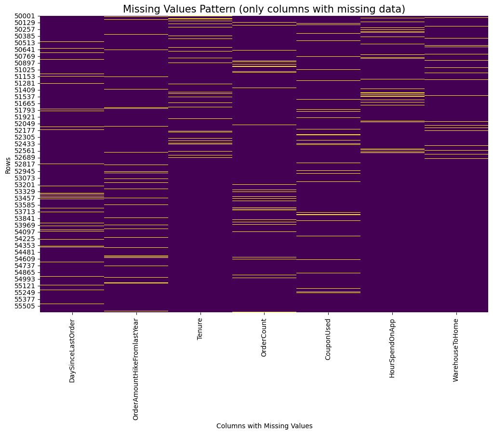
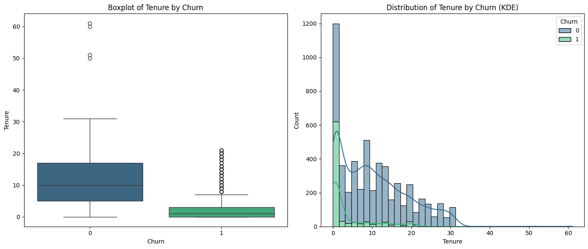
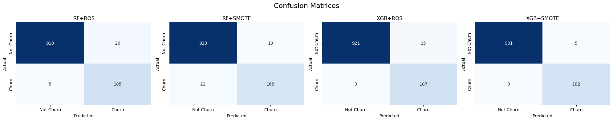
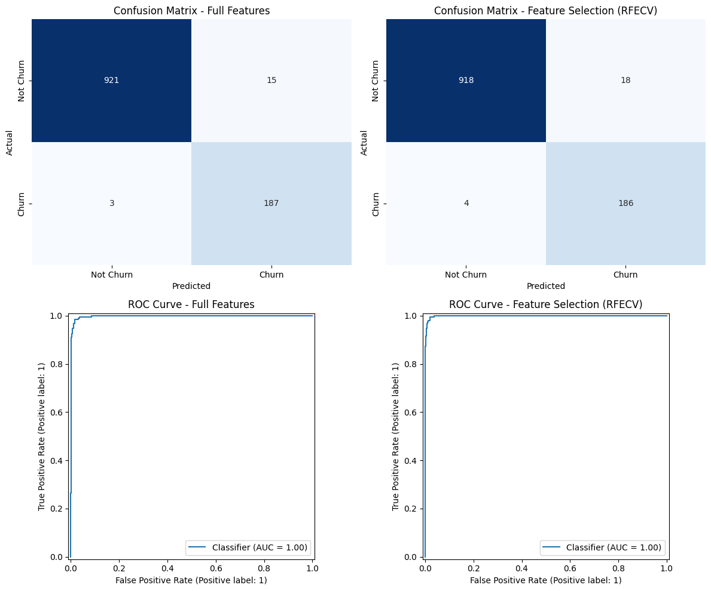
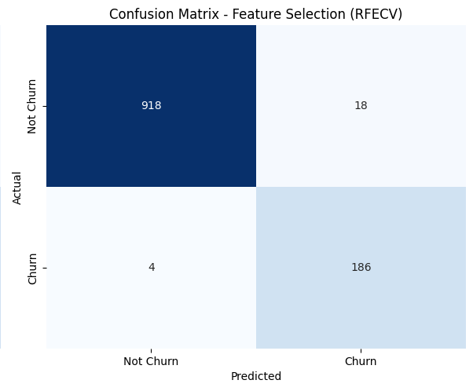

# 🛒 Customer Churn Prediction – E-commerce Case Study

## 📌 Business Problem Statement
The Kaggle dataset represents a **general e-commerce retail model**, where churn means customers became inactive.  

In retail e-commerce, annual churn rates of **60–80%** are common  
([Ecommerce Fastlane](https://ecommercefastlane.com/ecommerce-churn-rates-measure-and-reduce-lost-customers-and-revenue/?utm_source=chatgpt.com);  
[Sobot.io](https://www.sobot.io/article/average-churn-rate-for-ecommerce-stores-trends-2024-2025/?utm_source=chatgpt.com)).  

For this project, we **assume the dataset reflects one month of customer activity**.  
Under this assumption, the ~16% churn rate is far above healthy monthly benchmarks of **5–10%** seen in subscription-style e-commerce  
([ScaleMath](https://scalemath.com/blog/what-is-a-good-monthly-churn-rate/?utm_source=chatgpt.com);  
[Opensend](https://www.opensend.com/post/churn-rate-ecommerce?utm_source=chatgpt.com)).  

This makes churn reduction a **serious business problem** and a strong candidate for predictive modeling and retention strategies.

---

## 🎯 Project Objectives
- Build a predictive model to **identify customers at risk of churn**.
- Enable **what-if scenario simulation** (e.g., improving satisfaction, resolving complaints).
- Provide **actionable recommendations** to reduce churn.
- Evaluate the **business impact** of churn reduction strategies.

---

## Evaluation Metrics

For this churn dataset, the following evaluation setup will be used:

1. **Main Metric → F2-Score**  
   - Prioritizes Recall 4× more than Precision, reflecting the fact that **acquiring a new customer is 5–25× more expensive than retaining an existing one** ([Harvard Business Review, 2014](https://hbr.org/2014/10/the-value-of-keeping-the-right-customers?utm_source=chatgpt.com)).  
   - This makes missing churners (false negatives) far more costly than mistakenly targeting loyal customers (false positives).  
   - Supported by churn prediction literature, where Recall-oriented metrics (e.g., F2) are recommended for imbalanced datasets ([Verbeke et al., 2012](https://doi.org/10.1016/j.dss.2012.05.005)).  

2. **Supporting Metric → ROC-AUC**  
   - Evaluates model discriminative power independent of thresholds.  
   - Widely used in churn research as a benchmark for classification quality.  

3. **Supporting Tool → Precision & Recall**  
   - Reports Precision and Recall for each class.  
   - Provides transparency into trade-offs, allowing business stakeholders to see exactly how many churners are caught versus how many loyal customers are misclassified.  

**Summary:**  
- **F2-Score** will be the headline evaluation metric.  
- **ROC-AUC** provides a threshold-independent comparison across models.  
- **Precision & Recall** ensures interpretability and business clarity.

---

## Exploratory Data Analysis

Data columns (total 20 columns) & 5630 rows:

| # | Column Name | Non-Null Count | Data Type |
| :--- | :--- | :--- | :--- |
| 0 | CustomerID | 5630 | `int64` |
| 1 | Churn | 5630 | `int64` |
| 2 | Tenure | 5366 | `float64` |
| 3 | PreferredLoginDevice | 5630 | `object` |
| 4 | CityTier | 5630 | `int64` |
| 5 | WarehouseToHome | 5379 | `float64` |
| 6 | PreferredPaymentMode | 5630 | `object` |
| 7 | Gender | 5630 | `object` |
| 8 | HourSpendOnApp | 5375 | `float64` |
| 9 | NumberOfDeviceRegistered | 5630 | `int64` |
| 10 | PreferedOrderCat | 5630 | `object` |
| 11 | SatisfactionScore | 5630 | `int64` |
| 12 | MaritalStatus | 5630 | `object` |
| 13 | NumberOfAddress | 5630 | `int64` |
| 14 | Complain | 5630 | `int64` |
| 15 | OrderAmountHikeFromlastYear | 5365 | `float64` |
| 16 | CouponUsed | 5374 | `float64` |
| 17 | OrderCount | 5372 | `float64` |
| 18 | DaySinceLastOrder | 5323 | `float64` |
| 19 | CashbackAmount | 5630 | `float64` |

- Missing Values Exist

- Most of the numerical features are not normal distributed

---

## Methodology Analysis

**Benchmarking**

--- ROS Results Summary ---

| Model | F2-Score | ROC-AUC | Precision | Recall |
| :--- | :--- | :--- | :--- | :--- |
| RandomForestClassifier | 0.967403 | 0.998650 | 0.963351 | 0.968421 |
| XGBClassifier | 0.964173 | 0.999022 | 0.968254 | 0.963158 |
| DecisionTreeClassifier | 0.876727 | 0.925664 | 0.911602 | 0.868421 |
| KNeighborsClassifier | 0.864374 | 0.969408 | 0.630662 | 0.952632 |
| LogisticRegression | 0.723801 | 0.884233 | 0.445355 | 0.857895 |

--- SMOTE Results Summary ---
| Model | F2-Score | ROC-AUC | Precision | Recall |
| :--- | :--- | :--- | :--- | :--- |
| XGBClassifier | 0.958904 | 0.997627 | 0.962963 | 0.957895 |
| DecisionTreeClassifier | 0.916581 | 0.950793 | 0.843602 | 0.936842 |
| RandomForestClassifier | 0.892667 | 0.995133 | 0.928177 | 0.884211 |
| KNeighborsClassifier | 0.856742 | 0.968466 | 0.594156 | 0.963158 |
| LogisticRegression | 0.705301 | 0.882720 | 0.444759 | 0.826316 |

`XGBoostClassifier` and `RandomForestClassifier` chosen as benchmark models using oversampling `Random Oversampling` and `SMOTE`

**Hyperparameter Tuning**
| Experiment | F2-Score | Precision | Recall | ROC-AUC |
| :--- | :--- | :--- | :--- | :--- |
| XGB+ROS | 0.971933 | 0.925743 | 0.984211 | 0.997824 |
| XGB+SMOTE | 0.960929 | 0.973262 | 0.957895 | 0.998459 |
| RF+ROS | 0.952626 | 0.876777 | 0.973684 | 0.997245 |
| RF+SMOTE | 0.892667 | 0.928177 | 0.884211 | 0.995133 |

`XGBoostClassifier` using `ROS` is the best preprocess + model pipeline

**Feature Selection**
| Pipeline | F2-Score | Precision | Recall | ROC-AUC |
| :--- | :--- | :--- | :--- | :--- |
| Full Features | 0.971933 | 0.925743 | 0.984211 | 0.997824 |
| Feature Selection (RFECV) | 0.964730 | 0.911765 | 0.978947 | 0.998617 |

## Conclusion
A high-performing XGBoost model is successfully developed to predict customer churn. The **Recursive Feature Elimination with Cross-Validation (RFECV)** feature selection process successfully reduced the number of features from 31 to 27 with minimal impact on model performance. The primary metric, **F2-Score**, which prioritizes recall (catching churners), remains excellent for both models, with the feature-selected model achieving a score of **0.965**. This indicates that the model is highly effective at identifying customers at risk of churning.

***

* **Tenure:** This is the **most significant predictor** of churn. New customers (`low Tenure`) are far more likely to churn than long-term customers. This is a common pattern and suggests that the initial customer experience is critical.
* **Customer Complaints:** Having a complaint on file (`Complain_0`) is the **second most important factor** and a very strong indicator of churn risk. Customers who have complained are highly likely to leave.
* **Payment and Login Methods:** The preferred payment mode (`PreferredPaymentMode_Credit Card`, `PreferredPaymentMode_E wallet`) and login device (`PreferredLoginDevice_Computer`) are important signals. This may suggest that customers who use specific methods or devices have different engagement patterns.
* **Marital Status:** Being single (`MaritalStatus_Single`) is a notable predictor of churn, while being married has a smaller impact. This finding aligns with the observation that different customer demographics have different churn probabilities.
* **Order and Engagement Metrics:** Features like `OrderAmountHikeFromlastYear`, `NumberOfAddress`, and `CashbackAmount` all have a strong negative correlation with churn. Customers who show have more addresses, receive higher cashback are much less likely to churn. The `SatisfactionScore` may not have clear measure in what context it is since it has a strong positive correlation with churn. 

## Recommendation Actions
1.  **Focus on New Customer Retention:** Since `Tenure` is the top predictor, create a proactive retention strategy specifically for new customers in their first few months. This could include personalized onboarding, exclusive offers, or check-in surveys to ensure they have a positive experience.
2.  **Establish a Complaint Resolution Task Force:** Given the strong link between complaints and churn, implement a high-priority system to handle customer complaints swiftly and effectively. The goal should be to resolve issues to the customer's satisfaction within a specific timeframe and monitor their engagement afterward.
3.  **Launch a Customer Engagement Program:** Use the model to identify customers with low `SatisfactionScore` or low `CashbackAmount` and target them with personalized campaigns. For example, offer a loyalty program that rewards higher cashback or a survey with a discount incentive to improve their satisfaction.
4.  **Leverage Feature Selection for Production:** The RFECV-selected model is the best choice for deployment. It uses a smaller number of features (27 vs. 31), which simplifies data collection and processing in a production environment without sacrificing performance. The high F2-score and ROC-AUC for this model prove its reliability.
5.  **Develop Targeted Campaigns for Specific Demographics:** Use the insights from the `MaritalStatus` feature to create tailored marketing campaigns. For example, offer benefits or products that appeal to single customers to increase their engagement and loyalty.

## Measurable Impact

### Assumptions for this Simulation 💰

To quantify the impact, we'll assign monetary values based on common business metrics.

* **Average Customer Lifetime Value (CLV):** Let's assume the average customer generates **$480** in revenue over their lifetime.
* **Customer Retention Cost (CRC):** The cost to save an at-risk customer (e.g., a discount, a personalized call) is **$50**.
* **Customer Acquisition Cost (CAC):** Based on the principle that CAC is 5x CRC, we'll set this at **$250**.

Using the Confusion Matrix for the **Feature Selection (RFECV)** model, here's how we measure the impact for a sample of 1,126 customers.

***

### 1. The Cost of Mistakes

#### **False Negatives (FN): The Most Expensive Error**
These are customers the model missed, and who subsequently churned. This is the core reason for building a churn model.
* **Number of FNs:** 4 customers
* **Business Impact:** You lose their lifetime value and must spend money to acquire a new customer to replace them.
* **Cost Calculation:** 4 FNs × (Lost CLV + CAC)
* **Total Cost:** 4 × ($480 + $250) = **$2,920**

#### **False Positives (FP): The Less Costly Error**
These are customers the model incorrectly flagged as at-risk, so you spent resources on them unnecessarily.
* **Number of FPs:** 18 customers
* **Business Impact:** This is a wasted retention cost. You spend money on a customer who would have stayed anyway.
* **Cost Calculation:** 18 FPs × CRC
* **Total Cost:** 18 × $50 = **$900**

***

### 2. The Value of Correct Predictions

#### **True Positives (TP): The Highest ROI**
These are customers the model correctly identified as at-risk. You can now act to save them.
* **Number of TPs:** 186 customers
* **Business Impact:** You successfully saved a customer's lifetime value by spending a small retention cost.
* **Value Calculation:** 186 TPs × (CLV saved - CRC spent)
* **Total Value:** 186 × ($480 - $50) = **$79,980**

#### **True Negatives (TN): The Baseline**
These are customers correctly identified as loyal, so no action is needed.
* **Number of TNs:** 918 customers
* **Business Impact:** The model helps you save money by confirming who is safe, so you don't waste resources.
* **Total Value:** 918 TNs × ($0 cost) = **$0** (in immediate cost savings, the value is in avoiding unnecessary spending).

***

### Summary of Measurable Impact

By deploying this model, the business gains a clear financial advantage:

| Prediction Outcome    | Financial Value (or Cost) |
|-----------------------|---------------------------|
| **Total Value from TP** | **+$79,980** |
| **Total Cost from FP** | **-$900** |
| **Total Cost from FN** | **-$2,920** |
| **Net Financial Impact**| **+$76,160** |

The analysis shows that the **net value created by the model is over $76,000** for this group of customers. The model is exceptionally good at preventing the most expensive mistake (churning customers) and generates a huge return on the small costs of its misclassifications.